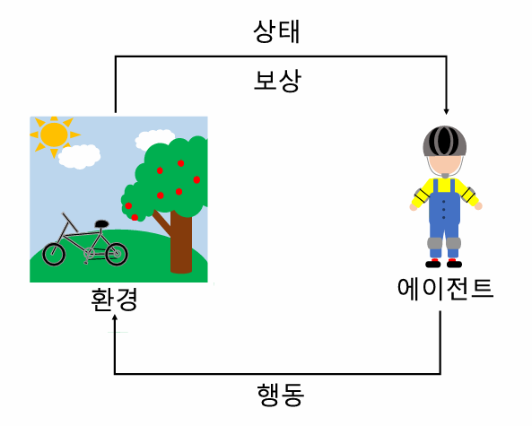
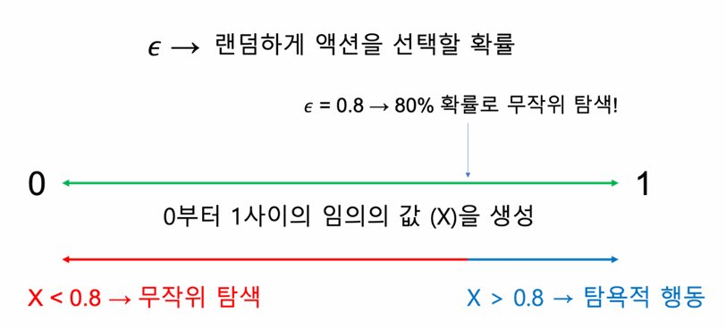
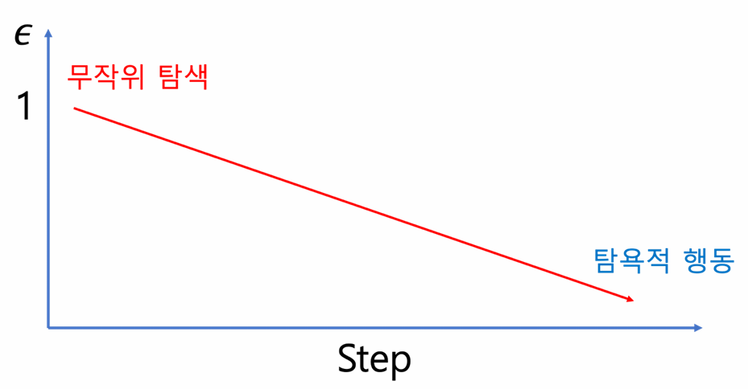

# Section2. 강화학습 개요
***

## 1. 강화학습이란?

- **기계학습**  
  코드로 명시하지 않은 동작을 데이터로부터 학습하여 실행할 수 있도록 알고리즘을 개발하는 연구분야  
  지도 학습, 비지도 학습, 강화학습의 세 가지 유형으로 나눌 수 있음

  - **지도 학습**  
    - 정답이 있는 학습 데이터 세트가 필요  
    - 머신러닝 알고리즘이 예측한 값과 실제 정답의 오차를 줄여나가도록 반복적으로 학습 수행  
    - 회귀나 분류 등의 문제를 해결하는 데 사용

  - **비지도 학습**  
    - 데이터 세트에 정답이 존재하지 않으며, 데이터가 가진 특징만을 기반으로 학습을 수행  
    - 군집화 등의 문제를 해결하는 데 사용

  - **강화 학습**  
    - 정답이 있지도, 특징만을 기반으로 학습하지도 않음  
    - 보상을 기준으로 보상을 최대화하도록 학습  
    - 여러 시행착오를 통해 비교적 명확한 보상을 설정할 수 있는 문제 해결에 사용

- **강화 학습 예시**  
  - 에이전트: 처음 자전거를 타는 사람  
  - 환경: 자전거를 타는 상황  
  - 패널티: 자전거를 타다가 넘어지면 힘이 들고 아픔  
  - 보상: 자전거를 잘 타면 재미있고 뿌듯함  
  - 다수의 시도를 통해 점점 넘어지지 않고 자전거를 타도록 학습

***

## 2. 강화학습의 기초 용어

- **MDP (Markov Decision Process)**  
  - 순차적 의사 결정 과정을 수학적으로 모델링 한 기법  
  - 즉, 강화 학습으로 문제를 풀 때는 문제를 MDP로 모델링  
  - 상태, 행동, 보상 함수, 상태 변환 확률, 감가율로 구성

- **에이전트 (Agent)**  
  강화학습에서 의사결정을 하는 역할

- **환경 (Environment)**  
  에이전트의 의사 결정을 반영하고 에이전트에게 정보를 주는 시스템

  

- **관측 (Observation)**  
  - 환경에서 제공하는 정보  
  - Unity ML-Agents에서는 관측을 시각적 관측과 수치적 관측으로 구분  
    - **시각적 관측 (Visual Observation)**  
      정보를 이미지로 표현한 것  
    - **수치적 관측 (Vector Observation)**  
      정보를 값들의 집합인 벡터로 나타낸 것  
  - 일반적으로 $t$ 시점에서의 관측은 $o_t$로 표기

- **상태 (State)**  
  - 에이전트가 상황을 인지하기 위해 사용하는 정보  
  - 일반적으로 $t$ 시점에서의 상태는 $s_t$로 표기

- **행동 (Action)**  
  - **이산적인 행동 (Discrete Action)**  
    행동의 선택지가 있어서 그 중 하나를 선택하는 방식  
  - **연속적인 행동 (Continuous Action)**  
    특정 값(실수)을 수치로 입력하여 행동  
  - 일반적으로 $t$ 시점에서의 행동은 $a_t$로 표기

- **스텝 (Step) & 에피소드 (Episode)**  
  - **스텝:** 에이전트가 한 번 행동을 취함  
  - **에피소드:** 게임 한판이 끝남

- **정책 (Policy)**  
  - 특정 상태에서 취할 수 있는 행동을 선택할 확률 분포  
  - 일반적으로 정책은 $\pi$로 표기

- **보상 함수 (Reward Function)**  
  특정 상태 $s$에서 특정 행동 $a$를 했을 때 얻는 보상의 기댓값 $R^a_s$  
  $$
  R^a_s = \mathbb{E}[R_{t+1} \mid S_t=s, A_t=a]
  $$

- **상태 변환 확률 (State Transition Function)**  
  상태 $s$에서 행동 $a$를 했을 때 다음 상태가 $s'$가 될 확률 $P^a_{ss'}$

- **감가율 (Discount Factor)**  
  - 미래의 보상을 얼마나 감가(discount)할지 결정해주는 비율  
  - 일반적으로 감가율은 $\gamma$로 표기  
  $$
  \gamma \in [0,1]
  $$

- **반환값 (Return)**  
  - 감가율을 고려한 보상들의 합  
  - 일반적으로 반환값은 $G$로 표기  
  $$
  G_t = R_{t+1} + \gamma R_{t+2} + \gamma^2 R_{t+3} + \cdots
  $$
  $$
  G_t =
  \begin{cases}
  R_{t+1} & (\gamma = 0) \\
  R_{t+1} + R_{t+2} + R_{t+3} + \cdots & (\gamma = 1)
  \end{cases}
  $$

- **가치 함수와 큐 함수**  
  - **가치:** 상태의 반환 값에 대한 기댓값  
  - **가치 함수**  
    - 특정 상태에 대한 가치를 도출하는 함수  
      $$
      V(s) = \mathbb{E}[G_t \mid S_t = s] \rightarrow \mathbb{E}[R_{t+1} + \gamma R_{t+2} + \gamma^2 R_{t+3} + \cdots \mid S_t = s]
      $$
    - 가치 함수를 통해 표현한 최적의 행동  
      $$
      a^* = \arg\max_{a \in A} V(s')
      $$
  - **큐 함수**  
    - 각 상태에서 특정 행동에 대한 가치를 도출하는 함수  
      $$
      Q(s,a) = \mathbb{E}[G_t \mid S_t = s, A_t = a] \rightarrow \mathbb{E}[R_{t+1} + \gamma R_{t+2} + \gamma^2 R_{t+3} + \cdots \mid S_t = s, A_t = a]
      $$
    - 큐 함수를 통해 표현한 최적의 행동  
      $$
      a^* = \arg\max_{a \in A} Q(s,a)
      $$

***

## 3. 강화학습의 기초 이론

- **벨만 방정식 (Bellman Equation)**  
  - 현재 상태의 가치 함수와 다음 상태의 가치 함수 사이의 관계를 나타낸 식  
  - **벨만 기대 방정식**  
    $$
    v_\pi(S_t) = \mathbb{E}_\pi[R_{t+1} + \gamma v_\pi(S_{t+1}) \mid S_t = s]
    $$
  - **큐 함수에 대한 벨만 방정식**  
    $$
    q_\pi(s,a) = \mathbb{E}_\pi[R_{t+1} + \gamma q_\pi(S_{t+1}, A_{t+1}) \mid S_t = s, A_t = a]
    $$
  - **벨만 최적 방정식**  
    - 현재 정책에 대한 최적의 가치 함수  
      $$
      v_*(s) = \max_{\pi}v_\pi(s) = \max_{a}\mathbb{E}[R_{t+1} + \gamma v_\pi(S_{t+1}) \mid S_t = s, A_t = a]
      $$
      $$
      q_*(s,a) = \max_{\pi}q_\pi(s,a) = \mathbb{E}[R_{t+1} + \gamma \max_{a'}q_*(S_{t+1}, a') \mid S_t = s, A_t = a]
      $$

- **탐험과 이용 (Exploration & Exploitation)**  
  에이전트가 최적 정책을 찾기 위해서는 여러 상황에서 다양한 행동을 하며 많은 경험을 해보는 것이 필수

  - **탐험:** 에이전트가 다양한 경험을 할 수 있도록 행동을 결정하는 기법  
    - 기본적인 방법 중 하나는 무작위 탐색 방법 (Random Exploration)  
      같은 확률로 에이전트가 취할 수 있는 행동 중 하나를 임의로 선택  
    - 너무 다양한 경험만을 추구하는 것도 좋지 않음 (시간 증가)  

  - **이용:** 학습된 결과에 따라 에이전트의 행동을 결정하는 기법  
    - 기본적인 방법 중 하나는 탐욕적 방법 (Greedy Method)  
      주어진 상태에서 가장 큰 가치를 얻을 수 있을 것으로 기대되는 행동만을 선택

  - $\epsilon$-greedy  
    - 최적의 정책을 찾기 위해 탐색과 이용을 적절히 수행하는 기법  
    - 학습 초기에는 탐색을 수행할 확률을 높게 설정  
    - 학습이 진행될수록 이용을 수행할 확률을 늘림  
    - $\epsilon$은 무작위 행동(Random Action)을 취할 확률을 의미  
    - $(1-\epsilon)$은 가장 높은 큐 함수 값을 가지는 행동을 취하도록 하는 탐욕적인(Greedy) 행동을 수행할 확률을 의미  

    

      
    

    - 일반적으로 $\epsilon$-greedy 기법을 사용할 때는 $\epsilon$의 값을 1부터 시작하여 조금씩 감소시킴

    

      
    

