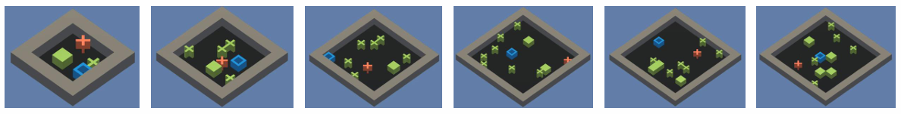
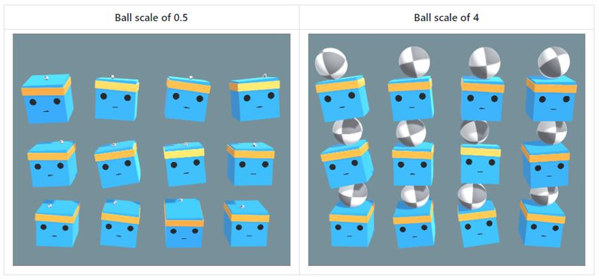
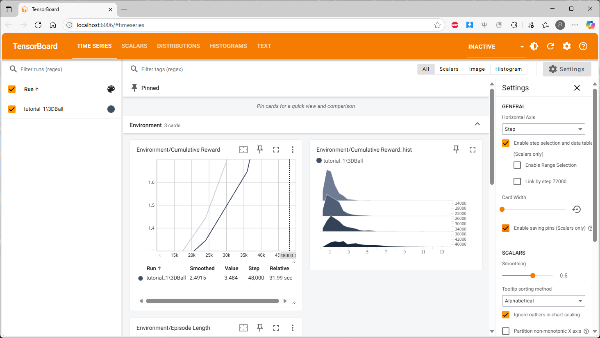

# Section3. Unity ML-Agents 살펴보기
***
[Week2 실습 - 3D Ball](./practice/3DBall/)  
***

## 1. Unity ML-Agents란?  

- Unity를 이용한 인공지능 Agent 학습을 지원하는 오픈소스  
- 기본적으로 강화학습을 위한 다양한 기능 제공  
- Agent가 다양한 경험을 수행하며 학습  
- 실제 환경 적용이 어려운 강화학습의 단점 해결  
  - 시공간과 실패에 제약이 없음  

#### - 적용과정  
1. Unity를 이용한 환경 제작  
2. 제작된 환경에 ML Agent 적용 및 설정  
3. 강화학습을 통해 Agent 학습  
4. 학습이 완료된 Agent 모델을 다시 Unity에 임베딩  
5. Unity 환경을 빌드하여 학습된 Agent를 적용  

***

## 2. Unity 개발 환경 구성

  Unity 6000.1.41f1  
  Unity ML-Agents 3.0.0  
  Python 3.10  

***

## 3. ML-Agents 살펴보기  

- ### Agent Inspector  
  - #### Behavior Parameters (필수 - 학습 관련)
    - Behavior Name
    - Vector Observation
    - Actions
    - Model
    - Behavior Type
    - Team Id
    - Use Child Sensors
    - Observable Attribute Handling
  - #### Ball 3D Agent (필수 - Agent 관련 스크립트)
    - Max Step
    - Specific to Ball3D

- ### Ball 3D Agent (Script)
  - #### Initialize()  
    환경이 실행될 때 호출되는 초기화 함수
    ```cs
    public override void Initialize()
    {
      m_BallRb = ball.GetComponent<RigidBody>();
      m_ResetParams = Academy.Instance.EnvironmentParameters;
      SetResetParameters();
    }
    ```

  - #### CollectObservations(VectorSensor)  
    Agent에게 Vector Observation 정보를 전달해주는 함수
    ```cs
    public override void CollectObservations(VectorSensor sensor)
    {
      if (useVecObs)
      {
        sensor.AddObservation(gameObject.transform.rotation.z);  // z rotation 값 (scalar)
        sensor.AddObservation(gameObject.transform.rotation.x);  // x rotation 값 (scalar)
        sensor.AddObservation(ball.transform.position - gameObject.transform.position);  // ball과의 거리 (vector)
        sensor.AddObservation(m_BallRb.velocity);  // ball의 속도 (vector)
      }
    }
    ```

  - #### OnActionReceived(ActionBuffers)  
    Agent가 결정한 행동을 전달, 보상 업데이트, 에피소드 종료
    ```cs
    public override void OnActionReceived(ActionBuffers actionBuffers)
    {
      // Agent가 결정한 행동을 Action Buffer에서 가져옴
      var actionZ = 2f * Mathf.Clamp(actionBuffers.Continuous[0], -1f, 1f);
      var actionX = 2f * Mathf.Clamp(actionBuffers.Continuous[1], -1f, 1f);

      // 가져온 행동을 환경에 반영
      if ((gameObject.transform.rotation.z < 0.25f && actionZ > 0f) ||
          (gameObject.transform.rotation.z > -0.25f && actionZ < 0f))
      {
        gameObject.transfrom.Rotate(new Vector3(0, 0, 1), actionZ);
      }

      if ((gameObject.transform.rotation.x < 0.25f && actionX > 0f) ||
          (gameObject.transform.rotation.x > -0.25f && actionX < 0f))
      {
        gameObject.transform.Rotate(new Vector3(1, 0, 0), actionX);
      }

      // 보상과 에피소드 종료 or 패널티를 결정
      // 공이 떨어지는 상황에서, 공과 판 사이의 거리를 기준으로 보상 or 패널티를 결정하는 예시
      if ((ball.transform.position.y - gameObject.transform.position.y) < -2f ||
          Mathf.Abs(ball.transform.position.x - gameObject.transform.position.x) > 3f ||
          Mathf.Abs(ball.transform.position.z - gameObject.transform.position.z) > 3f)
      {
        SetReward(-1f);
        EndEpisode();
      }
      else
      {
        SetReward(0.1f);
      }
    }
    ```

  - #### OnEpisodeBegin()  
    각 에피소드가 시작될 때 호출되는 함수
    ```cs
    public override void OnEpisodeBegin()
    {
      gameObject.transform.rotation = new Quaternion(0f, 0f, 0f, 0f);
      gameObject.transform.Rotate(new Vector3(1, 0, 0), Random.Range(-10f, 10f));
      gameObject.transform.Rotate(new Vector3(0, 0, 1), Random.Range(-10f, 10f));
      m_BallRb.velocity = new Vector3(0f, 0f, 0f);
      ball.transform.position = new Vector3(Random.Range(-1.5f, 1.5f), 4f, Random.Range(-1.5f, 1.5f))
        + gameObject.transform.position;
      // Reset the parameters when the Agent is reset.
      SetResetParemeters();
    }
    ```

  - #### Heuristic(in ActionBuffers)  
    개발자가 직접 명령을 내리는 휴리스틱 모드에서 사용 (주로 테스트, 모방 학습에 사용)
    ```cs
    public override void Heuristic(in ActionBuffers actionsOut)
    {
      var continuousActionsOut = actionsOut.ContinuousActions;
      continuousActionsOut[0] = -Input.GetAxis("Horizontal");
      continuousActionsOut[1] = Input.GetAxis("Vertical");
    }
    ```

- ### Decision Requester  
  Agent의 행동을 정책에게 요청하는 컴포넌트
- ### Model Overrider (Script)  
  학습이 완료된 후 모델의 유효성을 검사하기 위해 내부적으로 사용되는 클래스 (ML Agents 설정에 필수 요소는 아님)

***

## 4. ML-Agents 환경 학습

- ### ML-Agents에서 제공하는 알고리즘
  - Reinforcement Learning  
    - Proximal Policy Optimization (PPO)
    - Soft Actor Critic (SAC)
    - Curiosity based Exploration (ICM, RND) &rightarrow; Hard Exploration
    - Multi-Agent Posthumous Credit Assignment (MA-POCA) &rightarrow; Multi-Agent
  - Imitation Learning
    - Behavioral Cloning
    - Generative Adversarial Imitation Learning (GAIL; GAN 방식 도입)

- ### ML-Agents에서 제공하는 학습 방식
  - Solving Complex Tasks using <u>**Curriculum Learning**</u>  
    - 처음부터 가장 여러운 난이도의 문제를 학습하기 어렵기 때문에 순차적으로 단계를 높여가면서 학습 수행
    - ex) 소코반에서 맵의 크기, 박스의 수 등을 늘려가면서 순차적으로 난이도를 높이며 학습을 진행  

      
      
  - Training Robust Agents using Environment <u>**Parameter Randomization**</u>  
    - 환경 내의 다양한 parameter를 변경해가면서 강인한 Agent를 학습하는 방식
    - ex) 운전 상황에서 노면 마찰 계수, 드론 제어 상황에서 바람의 세기, 3D Ball 예시에서 ball의 scale

      

  - Multi-Agent Reinforcement Learning (MARL)
    - 일반적인 강화학습의 경우 하나의 환경에 하나의 agent가 존재 &rightarrow; 하나의 agent만 제어
    - MARL: 하나의 환경 내에 다수의 에이전트가 존재하는 문제 &rightarrow; 다수의 agents를 동시에 제어
    - 다수의 agents가 서로 협력하거나 경쟁하도록 학습
    - 실생활에서 다수의 문제들이 Multi-agent system으로 정의될 수 있음
    - ex) 물류 로봇, 자율주행, 드론 군집 제어, 네트워크 최적화, 신호등 제어
    - MARL의 종류
      1. Training in <u>**Competitive Multi-Agent**</u> Environments with Self-Play
      2. Training in <u>**Cooperative Multi-Agent**</u> Environments

- ### 학습 명령어

  ```bash
  mlagents-learn [Trainer_Path] --env=[Env_Path]/build_name --run_id=[run_id]
  ```

  - Trainer_Path: 학습 알고리즘 설정 YAML 파일이 위치한 경로 (default: ml-agent/config/)
  - Env_Path: 학습을 실행시킬 환경의 빌드 파일이 위치한 경로
  - Run_Id: 학습된 모델이 저장될 폴더 이름

- ### PPO
  - Parameters  

    [Config parameters 공식 GitHub 설명](https://github.com/Unity-Technologies/ml-agents/blob/main/docs/Training-Configuration-File.md#ppo-specific-configurations)  


    ```yaml
    behaviors:
      3DBall:
        trainer_type: ppo  # 학습에 사용할 기법 (default: ppo)
        hyperparameters:
          batch_size: 64  # 네트워크를 한번 학습할 때 이용할 데이터 수 (일반적으로 continuous action: 128~2048, discrete action: 32~512)
          buffer_size: 12000  # 네트워크 학습을 위해 저장하는 전체 데이터 수 (2048~409600, 클수록 안정적 학습 수행 가능)
          learning_rate: 0.0003  # 학습을 위한 초기 학습률 (default: 3e-4, 일반적으로 1e-5~1e-3으로 설정, 학습이 불안정하거나 보상이 지속적으로 증가하지 않을 경우 감소시킴)
          beta: 0.001  # (PPO) 높을수록 더 많은 랜덤 행동 (default: 5e-3, 일반적으로 1e-4~1e-2)
          epsilon: 0.2  # (PPO) 낮을수록 안정적이지만 느린 학습 (default: 5e-3, 일반적으로 1e-4~1e-2)
          lambd: 0.99  # (PPO) Generalized Advantage Estimate의 Regulariztion parameter (default: 0.95, 일반적으로 0.9~0.95)
          num_epoch: 3  # (PPO) buffer의 모든 data를 batch로 학습 수행 1회 = 1 epoch, 클수록 안정적이지만 느린 학습 (default: 3, 일반적으로 3~10)
          learning_rate_schedule: linear  # 시간에 따른 learning_rate 변화 방법 (default: linear(PPO), constant(SAC))
        network_settings:
          normalize: true  # Vector observation 입력 데이터 정규화 여부
          hidden_units: 128  # 인공신경망의 각 층에서 사용할 노드의 개수
          num_layers: 2  # 인공신경망의 층 수
          vis_encode_type: simple  # Visual observation 입력을 인코딩할 모델 (default: simple)
        reward_signals:
          extrinsic:
            gamma: 0.99  # discount factor (default: 0.99, 일반적으로 0.8~0.995)
            strength: 1.0  # 보상*strength = 보상범위 (default: 1)
        keep_checkpoints: 5  # 유지할 모델 체크포인트의 최대 수 (default: 5)
        max_steps: 500000  # 학습 과정 종료까지의 스텝 수 (default: 5e5, 일반적으로 5e5~1e7)
        time_horizon: 1000  # Buffer에 데이터를 저장하기 전 데이터를 수집할 스텝 수 (default: 64, 일반적으로 32~2048)
        summar_freq: 12000  # 학습 통계를 기록할 스텝 주기 (default: 50000)
    ```

***

## 5. Python API를 활용한 ML-Agents

- Python API 예제 코드

  - 초기 세팅  
    ```python
    from mlagents_envs.environment import UnityEnvironment

    if __name__ == '__main__':
      # 환경 정의
      env = UnityEnvironment(file_name='./Env/3DBall/3DBall')

      # behavior 불러오기
      env.reset()
      behavior_name = list(env.behavior_specs.keys())[0]
      print(f'name of behavior: {behavior_name}')
      spec = env.behavior_specs[behavior_name]
    ```
  - 에피소드 진행
    ```python
      for ep in range(10):
        env.reset()

        # agent가 행동을 요청한 상태인지, 마지막 상태인지 확인
        decision_steps, terminal_steps = env.get_steps(behavior_name)

        # 한 agent를 기준으로 로그 출력
        tracked_agent = -1
        done = False
        ep_rewards = 0

        while not done:
          # tracked agent 지정
          if tracked_agent == -1 and len(decision_steps) >= 1:
            tracked_agent = decision_steps.agent_id[0]

          # 랜덤 액션 결정
          action = spec.action_spec.random_action(len(decision_steps))

          env.set_actions(behavior_name, action)

          env.step()

          # 스텝 종료 후 agent 정보 (보상, 상태 등) 저장
          decision_steps, terminal_steps = env.get_steps(behavior_name)

          if tracked_agent in decision_steps:
            ep_rewards += decision_steps[tracked_agent].reward
          if tracked_agent in terminal_steps:
            ep_rewards += terminal_steps[tracked_agent].reward
            done = True

        print(f'total reward for ep {ep} is {ep_rewards}')

      env.close()
    ```

***

## 6. 실습

1. 명령 프롬프트에서 ml-agents 폴더 경로로 이동  

    ```bash
    cd Desktop\ml-agents-release_22\ml-agents-release_22
    ```

2. 학습 명령어 입력  

    - 빌드에서 실행
    ```bash
    mlagents-learn config\ppo\3DBall.yaml --env="..\..\Study\2025 Summer MKS\practice\3DBall\UnityEnvironment" --run-id=tutorial_1
    ```

    - 에디터에서 실행  
    ```bash
    mlagents-learn config\ppo\3DBall.yaml --run-id=tutorial_1
    ```

3. 실행 결과  

    [](https://youtu.be/4YuVOWemJuQ?si=JpWG_kfKAyK3waay)
  
4. Tensorboard를 통한 학습 진행 상황 확인  

    ```bash
    tensorboard --logdir=results --port=6006
    ```

    

5. 학습 결과  

  
