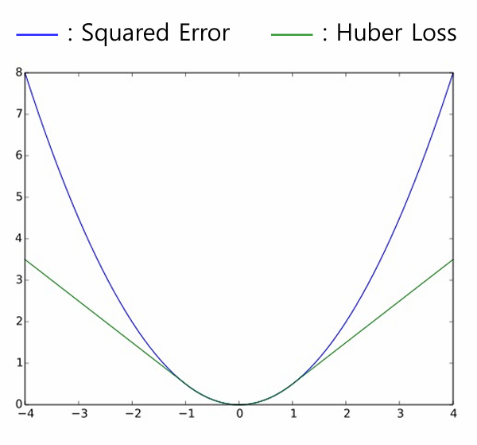
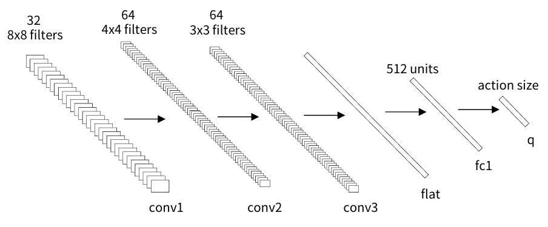

# Section5. DQN 알고리즘
***
[Week4 실습 - DQN 구현](./practice/DQN/)  
***

## 0. 강화학습의 종류

- #### 가치 기반 강화학습 (Value-based Reinforcement Learning)
  - 대표적인 알고리즘: Deep Q Network (DQN)
  - 가치를 기반으로 의사결정
  - 큐 함수를 학습하여 최적의 큐 함수를 얻고 이를 통해 의사결정 수행
  - 최적의 큐 함수는 
  [벨만 최적 방정식](./Section2.md#3-강화학습의-기초-이론)
  을 이용한 시간차 예측을 이용해 업데이트  

    $Q_{k+1}(S_t,A_t) \leftarrow Q_k(S_t,A_t) + \alpha (R_{t+1} + \gamma \max_{a'}Q_k(S_{t+1},a') - Q_k(S_t,A_t))$  

    - $\alpha$ = 학습률 (Learning rate)
    - (큐 함수의 계산 값) - (큐 함수의 예측 값) = 시간차 오차 (Temporal Differnce Error)
  - 시간차 오차의 값이 0에 가까워지도록 학습

- #### 정책 기반 강화학습 (Policy-based Reinforcement Learning)
  - *(Section6. A2C 알고리즘 학습 후 추가 작성)*

***

## 1. DQN 이론

- Deep Q Network (DQN)
  - 사람과 같이 게임화면을 입력으로 학습
  - 강화학습과 인공신경망을 성공적으로 결합
  - 합성곱 신경망(CNN)을 이용해 상태마다 각 행동의 큐 함수 값들을 근사

- 기존 강화학습 기법의 한계
  - 기존 큐 러닝과 같은 알고리즘은 **모든 상태와 행동**에 대한 큐 함수 값을 따로 저장, 이를 이용해 학습을 수행하고 행동 결정
  - 매우 많은 상태와 행동이 존재하는 환경에서는 사용이 어려움

- #### 장점
  - CNN을 통해 각 상태와 행동에 대한 큐 함수 값을 근사 $\rightarrow$ DQN
  - 모든 상태와 행동에 대한 큐 함수 값을 따로 저장하지 않고 큐 함수 값에 대한 추정 수행
  - DQN은 많은 상태와 행동이 존재하는 환경에서도 학습이 가능하며 좋은 성능을 보임

- DQN 알고리즘의 기법
  - 경험 리플레이 (Experience Replay)
    - 경험 데이터 (현재 상태, 현재 행동, 보상, 다음 상태, 게임 종료 정보) 를 사용
    - 매 스텝 리플레이 메모리에 경험 데이터 저장
    - 매 스텝마다 리플레이 메모리의 경험 데이터를 임의로 일정 개수만큼 추출
    - 추출된 경험 데이터들을 이용해 미니 배치 학습 수행
    - 장점  
      1. 데이터 간의 상관관계를 고려하지 않고 랜덤하게 샘플링하여 선형 근사
      2. 전체적인 데이터의 경향성을 더욱 잘 반영한 선형 근사 결과를 확인할 수 있음
  - 타겟 네트워크 (Target Network)
    - 학습에 필요한 타겟 값을 계산  

      $y=
      \begin{cases}
      r \\
      r+\gamma(\max_{a'}Q(s+{t+1}, a'; \theta^-))
      \end{cases}
      $

    - 타겟값 $y$와 예측값 $Q(s_t,a;\theta)$의 차이가 최소가 되도록 학습 수행
    - 타겟값
      - 네트워크가 학습하기 위한 목표가 되는 값 $\rightarrow$ 지도학습의 정답과 유사한 역할
      - 일반 네트워크를 이용하여 타겟값을 구하는 경우
        - 일반 네트워크는 매 스텝 학습 $\rightarrow$ 네트워크의 파라미터가 매 스텝 변함
        - 같은 입력을 사용해도 매 스텝마다 네트워크가 다른 정답을 도출할 수 있음
      - 학습의 목표가 되는 정답을 최대한 일정하게 유지 $\rightarrow$ 안정적인 학습이 가능
      - 타겟 네트워크를 이용하여 타겟값을 구하는 경우
        - 타겟 네트워크는 일정 스텝 동안 업데이트 하지 않음
        - 해당 스텝 동안 동일한 입력에 대해 동일한 타겟값을 도출
        - 학습의 안정성 향상에 크게 도움이 되는 기법
    - 손실함수 값을 최소화하기 위해 Huber loss 사용  
      - $Error = y - Q(s_t, a_t;\theta)$
      - $Loss = 
      \begin{cases}
      Error^2 & if |Error| \lt 1 \\
      |Error| & if |Error| \geq 1
      \end{cases}
      $

      

***

## 2. DQN 실습

  - 필요 라이브러리
    ```python
    import numpy as np # 행렬 연산 라이브러리
    import random # 난수 관련 라이브러리
    import copy # 복사 관련 라이브러리
    import datetime # 시간 관련 라이브러리
    import platform # 시스템 관련 라이브러리
    import torch # 딥러닝 라이브러리
    import torch.nn.functional as F # 신경망 관련 함수 라이브러리
    from torch.utils.tensorboard import SummaryWriter # 텐서보드 기록 라이브러리
    from collections import deque # 양방향 큐 자료구조 (DQN 리플레이 메모리 역할 수행)
    from mlagents_envs.environment import UnityEnvironment, ActionTuple # 유니티 환경 클래스 (유니티로 만든 환경 불러올 때 사용), 행동 튜플 객체 (액션을 환경에 전달하기 위한 행동 객체)
    from mlagents_envs.side_channel.engine_configuration_channel\
    import EngineConfigurationChannel # 유니티 환경 엔진 설정 관리 클래스 (유니티 환경 타임 스케일 조절)
    ```

  - 파라미터 값 설정
    ```python
    state_size = [3*2, 64, 84] # DQN 에이전트의 입력으로 사용할 상태의 크기
    action_size = 4 # DQN 에이전트의 출력으로 사용할 행동의 크기

    load_model = False # 모델 불러오기 여부
    train_model = True # 모델 학습 여부 (true: 학습모드, false: 평가모드)

    batch_size = 32 # 한 번 모델을 학습할 때 메모리에서 꺼내는 경험 데이터 수
    mem_maxlen = 10000 # 리플레이 메모리의 최대 크기
    discount_factor = 0.9 # 미래에 대한 보상 감가율
    learning_rate = 0.00025 # 네트워크 학습률

    run_step = 50000 if train_mode else 0 # 학습모드에서 진행할 스텝 수 설정 (평가모드일 때는 0)
    test_step = 5000 # 평가모드에서 진행할 스텝 수
    train_start_step = 5000 # 학습 시작 전에 리플레이 메모리에 충분한 데이터를 모으기 위해 몇 스텝 동안 임의의 행동으로 게임 진행할 것인지 설정
    target_update_step = 500 # 타겟 네트워크를 몇 스텝 주기로 업데이트할지 설정

    print_interval = 10 # 학습 진행 상황을 텐서보드에 기록할 주기
    save_interval = 100 # 학습 모델을 저장할 에피소드 주기

    epsilon_eval = 0.95 # 평가모드의 epsilon 값
    epsilon_init = 1.0 if train_mode else epsilon_eval # epsilon 초기값
    epsilon_min = 0.1 # 학습 구간에서의 epsilon 최솟값
    explore_step = run_step * 0.8 # epsilon이 감소되는 구간
    epsilon_delta = (epsilon_init - epsilon_min)/explore_step if train_mode else 0 # 한 스텝 당 감소하는 epsilon 변화량

    VISUAL_OBS = 0 # 시각적 관측 인덱스
    GOAL_OBS = 1 # 목적지 관측 인덱스
    VECTOR_OBS = 2 # 수치적 관측 인덱스
    OBS = VISUAL_OBS # DQN에서는 시각적 관측 인덱스를 사용

    game = "GridWorld" # 환경 빌드명
    os_name = platform.system() # 현재 OS
    if os_name == 'Windows':
      env_name = f"../envs/{game}_{os_name}/{game}" # 불러올 유니티 환경 경로
    elif os_name == 'Darwin':
      env_name = f"../envs/{game}_{os_name}"

    date_time = datetime.datetime.now().strftime("%Y%m%d%H%M%S") # 코드가 실행될 때의 시간 (폴더 이름 중복 방지)
    save_path = f"./saved_models/{game}/DQN/{date_time}" # 모델 파일 저장 경로
    load_path = f"./saved_models{game}/DQN/20210514201212" # 모델 파일 저장 경로

    device = torch.device("cuda" if torch.cuda.is_available() else "cpu") # 연산 장치 설정

    class DQN(torch.nn.Module):
      def __init__(self, ** kwargs): # 네트워크 구성 레이어 정의
          super(DQN, self).__init__(**kwargs) # 부모 클래스 초기화

          self.conv1 = torch.nn.Conv2d(in_channels = state_size[0], out_channels = 32, kernel_size = 8, stride = 4)
          dim1 = ((state_size[1] - 8) // 4 + 1, (state_size[2] - 8) // 4 + 1)
          self.conv2 = torch.nn.Conv2d(in_channels = 32, out_channels = 64, kernal_size = 4, stride = 2)
          dim2 = ((dim1[0] - 4) // 2 + 1, (dim1[1] - 4) // 2 + 1)
          self.conv3 = torch.nn.Conv2d(in_channels = 64, out_channels = 64, kernel_size = 3, stride = 1)
          dim3 = ((dim2[0] - 3) // 1 + 1, (dim2[1] - 3) // 1 + 1)

          self.flat = torch.nn.Flatten() # 1차원으로 변환
          self.fc1 = torch.nn.Linear(64 * dim3[0] * dim3[1], 512)
          self.q = torch.nn.Linear(512, action_size)

      def forward(self, x): # 네트워크 입력에 대한 큐 함숫값 계산
          x = x.permute(0, 3, 1, 2)
          x = F.relu(self.conv1(x))
          x = F.relu(self.conv2(x))
          x = F.relu(self.conv3(x))
          x = self.flat(x)
          x = F.relu(self.fc1(x))
          return self.q(x)
    ```
  - 네트워크 레이어 정의:  

    