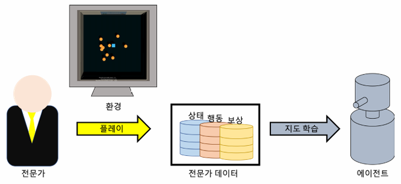
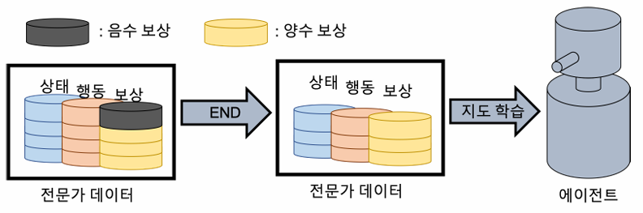
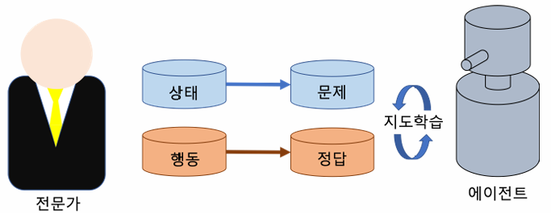

# Section 10. Behavioral Cloning (BC) 알고리즘
***

## 1. Behavioral Cloning 알고리즘 개요

- 일반 강화학습과의 차이점
  - **강화학습 :** 에이전트가 환경에서 직접 시행착오를 겪으면서 보상을 최대화하는 방향으로 학습
  - **모방학습 :** 전문가가 직접 환경을 플레이한 데이터를 통해 전문가가 취한 행동을 모방하도록 학습

  

- 보상이 음수인 데이터 제외
  - 전문가의 플레이 데이터를 그대로 모방
    - 전문가가 실수를 하는 경우(음의 보상)에도 해당 경험까지 그대로 모방하려고 함
  - 나쁜 경험(음의 보상)은 제외하고 모방학습을 수행하는 것이 좋음
    - 전문가의 플레이를 통해 기록된 데이터(상태, 행동, 보상)에서 보상이 음수인 데이터는 제외하고 나머지 데이터를 학습에 사용
  
  

***

## 2. Behavioral Cloning 알고리즘 기법

- Dropout
  - Overfitting
    - 머신러닝 알고리즘을 학습할 때 생길 수 있는 문제 중 하나
    - 학습 데이터에 대해 너무 과도하게 학습되어 새로운 데이터에 대한 추정 성능이 떨어지는 문제
  - Dropout
    - Overfitting 문제를 해결하는 기법 중 하나
    - 네트워크 연산을 수행할 때 일정 비율의 노드를 선정하여 출력을 0으로 도출
    - Dropout이 적용되는 노드와 학습되는 가중치가 연산마다 랜덤하게 달라지므로 overfitting 방지
  - BC를 위한 네트워크에 dropout 적용
    - 같은 입력에 대해서도 조금씩 다른 결과를 도출 $\rightarrow$ 다양한 결과를 확인

## 3. Behavioral Cloning 알고리즘 학습

- 지도 학습 방법으로 매 상태(문제)에 대해 전문가가 취한 행동(정답)을 모방하도록 학습
- 에이전트 입장에서는 일반적인 분류 문제를 푸는 것과 같음
- BC 알고리즘의 손실함수는 Cross Entropy를 사용하고 이를 최소화하는 방향으로 학습

