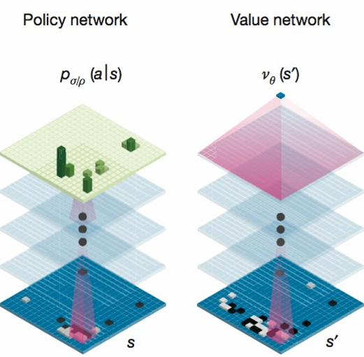
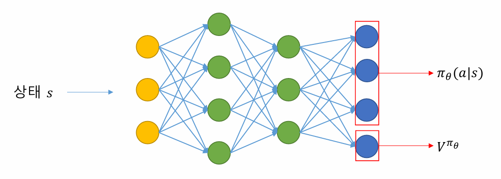
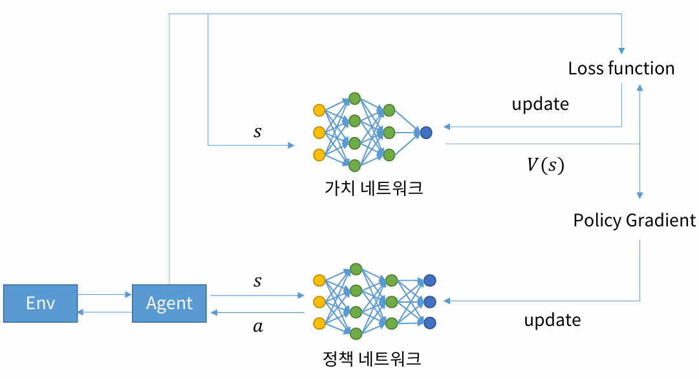
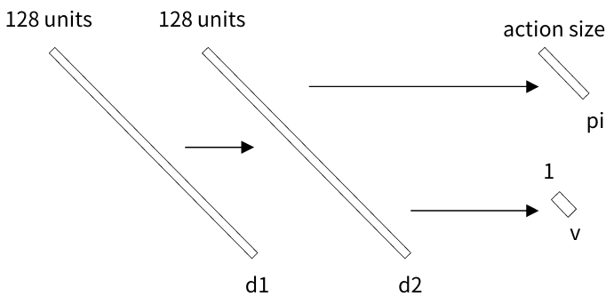
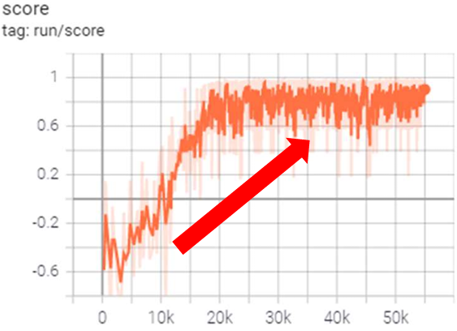

# Section6. A2C 알고리즘
***
[Week4 실습 - A2C 구현](./practice/A2C/)
***

## 1. A2C 이론

- ### Advantage Actor-Critic

  

  - 가치 기반과 정책 기반 강화학습을 결합
  - 두 종류의 네트워크 사용
    - Policy Network (정책 네트워크)
      - 정책을 직접 학습 $\rightarrow$ Policy gradient 사용
        - **Policy Gradient (A2C)**  
          동일한 네트워크의 마지막 부분만 분리하여 정책과 가치를 도출하는 경우도 있음

          

      - 학습한 정책을 이용하여 에이전트의 의사결정 수행
      - 목적함수  
        $\nabla_\theta J(\theta) = \text{E} [\nabla_\theta \log\pi_\theta(a|s) \text{⋅} (q_\pi(s,a) - v_\pi(s))]
        =\text{E}[\nabla_\theta \log\pi_\theta(a|s) A(s,a)]$

      - 손실함수
        - 정책 네트워크 (actor)  
          $L=\sum_i-(\log\pi_\theta(a_i|s_i)A(s_i,a_i))$
        - 가치 네트워크 (critic)  
          $L=\frac{1}{2}\sum_i(y_i-V(s_i))^2$ where $y_i=r_i + \gamma V(s_{i+1})$

    - Value Network (가치 네트워크)
      - DQN과 동일하게 가치를 학습
      - 상태와 행동에 대한 가치 도출
  
  - 구조

    

***

## 2. A2C 실습

- 필요 라이브러리
```python
import numpy as np
import datetime
import platform
import torch
import torch.nn.functional as F
from torch.utils.tensorboard import SummaryWriter
from mlagents_envs.environment import UnityEnvironment, ActionTuple
from mlagents_envs.side_channel.engine_configuration_channel import EngineConfigurationChannel
```

- 파라미터 값 설정
```python
state_size = 6*2 # 입력: 상태의 크기
action_size = 4 # 출력: 행동의 크기

load_model = False
train_mode = True

discount_factor = 0.9
learning_rate = 2.5e-4

run_step = 50000 if train_mode else 0
text_step = 5000

print_interval = 10
save_interval = 100

env_config = {"gridsize": 5, "numPlusGoals": 1, "numExGoals": 1}
VISUAL_OBS = 0
GOAL_OBS = 1
VECTOR_OBS = 2
OBS = VECTOR_OBS # A2C에서는 수치적 관측 인덱스 사용

game = "GridWorld"
os_name = platform.system()
if os_name =='Windows':
    env_name = f"../envs/{game}_{os_name}/{game}"
elif os_name =='Darwin':
    env_name = f"../envs/{game}_{os_name}"

date_time = datetime.datetime.now().strftime("%Y%m%d%H%M%S")
save_path = f"./saved_models/{game}/A2C/{date_time}"
load_path = f"./saved_models/{game}/A2C/20210217000848"

device = torch.device("cuda" if torch.cuda.is_available() else "cpu")
```

- Model 클래스
```python
class A2C(torch.nn.Module): # actor, Critic Network 정의
    def __init__(self, **kwargs):
        super(A2C, self).__init__(**kwargs)
        self.d1 = torch.nn.Linear(state_size, 128)
        self.d2 = torch.nn.Linear(128, 128)
        self.pi = torch.nn.Linear(128, action_size)
        self.v = torch.nn.Linear(128, 1)
        
    def forward(self, x): # 네트워크 입력에 대한 pi, v 계산
        x = F.relu(self.d1(x))
        x = F.relu(self.d2(x))
        return F.softmax(self.pi(x), dim=1), self.v(x)
```

- 네트워크 레이어 정의  

  

- Agent 클래스
```python
class A2cAgent:
    def __init__(self):
        self.a2c = A2C().to(device)
        self.optimizer = torch.optim.Adam(self.a2c.parameters(), lr=learning_rate)
        self.writer = SummaryWriter(save_path)

        if load_model:
            print(f"... Load Model from {load_path}/ckpt")
            checkpoint = torch.load(load_path+'/ckpt', map_location=device)
            self.a2c.load_state_dict(checkpoint['network'])
            self.optimizer.load_state_dict(checkpoint['optimizer'])

    def get_action(self, state, training=True): # 네트워크 연산에 따라 행동 결정
        self.a2c.train(training)

        pi, _ = self.a2c(torch.FloatTensor(state).to(device))
        action = torch.multinomial(pi, num_samples=1).cpu().numpy()
        return action

    def train_model(self, state, action, reward, next_state, done):
        state, action, reward, next_state, done = map(lambda x: torch.FloatTensor(x).to(device), [state, action, reward, next_state, done])
        pi, value = self.a2c(state)

        # 가치 신경망 손실함수 계산
        with torch.no_grad():
            _, next_value = self.a2c(next_state)
            target_value = reward + (1-done) * discount_factor * next_value
        critic_loss = F.mse_loss(target_value, value)

        # 정책 신경망 손실함수 계산
        eye = torch.eye(action_size).to(device)
        one_hot_action = eye[action.view(-1).long()]
        advantage = (target_value - value).detach()
        actor_loss = -(torch.log((one_hot_action * pi).sum(1)) * advantage).mean()
        total_loss = critic_loss + actor_loss

        self.optimizer.zero_grad()
        total_loss.backward()
        self.optimizer.step()

        return actor_loss.item(), critic_loss.item()

    def save_model(self):
        print(f"... Save Model to {save_path}/ckpt...")
        torch.save({
            'network': self.a2c.state_dict(),
            'optimizer': self.optimizer.state_dict(),
        }, save_path+'/ckpt')

    def write_summary(self, score, actor_loss, critic_loss, step):
        self.writer.add_scalar('run/score', score, step)
        self.writer.add_scalar('model/actor_loss', actor_loss, step)
        self.writer.add_scalar('model/critic_loss', critic_loss, step)
```

- Main 함수
```python
if __name__ == '__main__':
    engine_configuration_channel = EngineConfigurationChannel()
    env = UnityEnvironment(file_name=env_name, side_channel=[engine_configuration_channel])
    env.reset()

    behavior_name = list(env.behavior_specs.keys())[0]
    spec = env.behavior_specs[behavior_name]
    engine_configuration_channel.set_configuration_parameters(time_scale=12.0)
    dec, term = env.get_steps(behavior_name)

    agent = A2CAgent()
    actor_losses, critic_losses, scores, episode, score = [], [], [], 0, 0
    for step in range(run_step + test_step):
        if step == run_step:
            if train_mode:
                agent.save_model()
            print("TEST START")
            train_mode = False
            engine_configuration_channel.set_configuration_parameters(time_scale=1.0)

        preprocess = lambda obs, goal: np.concatenate((obs*goal[0][0], obs*goal[0][1]), axis=-1)
        state = preprocess(dec.obs[OBS], dec.obs[GOAL_OBS])
        action = agent.get_action(state, train_mode)
        real_action = action + 1
        action_tuple = ActionTuple()
        action_tuple.add_discrete(real_action)
        env.set_actions(behavior_name, action_tuple)
        env.step()

        dec, term = env.get_steps(behavior_name)
        done = len(term.agent_id) > 0
        reward = term.reward if done else dec.reward
        next_state = preprocess(term.obs[OBS], term.obs[GOAL_OBS]) if done\
            else preprocess(dec.obs[OBS], dec.obs[GOAL_OBS])
        score += reward[0]

        if train_mode:
            actor_loss, critic_loss = agent.train_model(state, action[0], [reward], next_state, [done])
            actor_losses.append(actor_loss)
            critic_losses.append(critic_loss)

        if done:
            episode += 1
            scores.append(score)
            score = 0

            if episode % print_interval == 0:
                mean_score = np.mean(scores)
                mean_actor_loss = np.mean(actor_losses) if len(actor_losses) > 0 else 0
                mean_critic_loss = np.mean(critic_losses) if len(critic_losses) > 0 else 0
                agent.write_summary(mean_score, mean_actor_loss, mean_critic_loss, step)
                actor_losses, critic_losses, scores = [], [], []

                print(f"{episode} Episode / Step: [step] / Score: {mean_score:.2f} / Actor loss: {mean_actor_loss:.2f} / Critic loss: {mean_critic_loss:.4f}")

            if train_mode and episode % save_interval == 0:
                agent.save_model()
    env.close()
```

- 학습 결과
    - TensorBoard로 학습 결과 확인  
      1. 결과 폴더로 이동  
        ```bash
        cd saved_models\GridWorld\A2C
        ```
      2. 텐서보드 실행  
        ```bash
        tensorboard --logdir=.
        ```
      3. 브라우저에서 TensorBoard 접속  
        ```
        http://localhost:6006/
        ```
    - **보상**  
      학습이 진행됨에 따라 **증가**  
      (Agent가 목표 지점까지 잘 도착함)  

      
