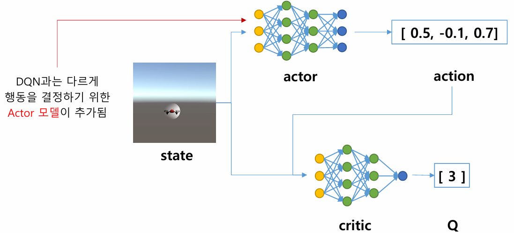
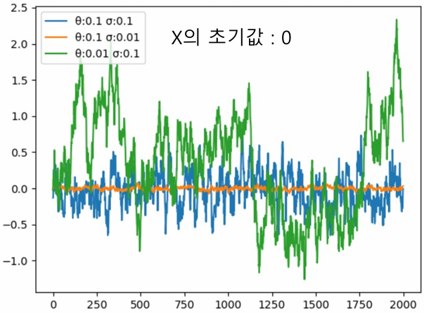
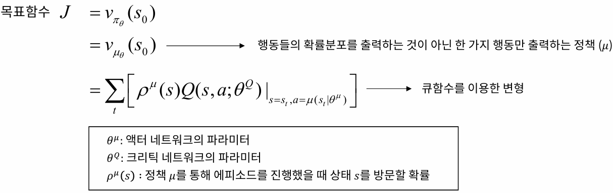
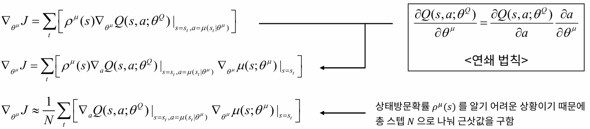
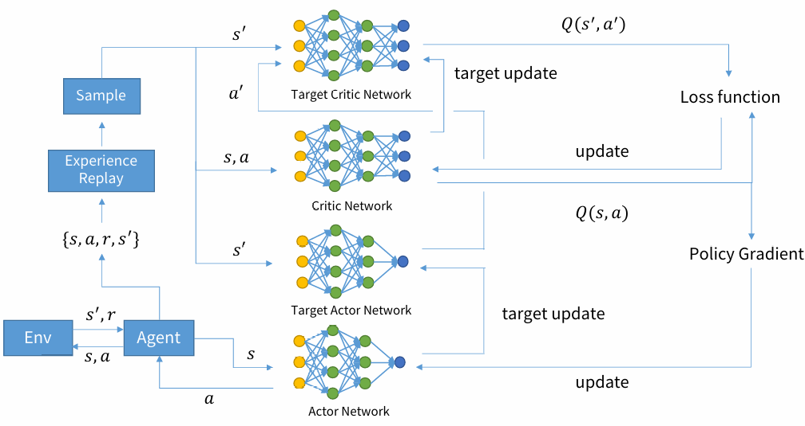

# Section7. DDPG 알고리즘
***

## 1. DDPG 알고리즘 개요
  - Deep Deterministic Policy Gradient (DDPG)
    - 기존 DQN 알고리즘은 이산적인 행동환경에만 적용 가능 (ex. 상하좌우)
    - 연속적인 행동이 필욯나 환경에서는 적용할 수 없음 (ex. 로봇 팔의 움직임, 로켓의 엔진 분출량)

  - Actor-Critic 기반 강화학습 알고리즘
  - DPG 알고리즘에 심층인공신경망 기법을 적용
  - 연속적인 값 중에서 한 가지 행동 값을 출력
  - DDPG 알고리즘 네트워크 구성

    

***

## 2. DDPG 알고리즘 기법
  - 경험 리플레이 (Experience Replay)
    - DQN에서 사용된 것과 동일한 기법 사용
    - 연속적인 결정 과정에서 발생하는 샘플 간의 상관관계 문제를 해결
  - 타겟 네트워크 (Target Network)
    - DQN과 같이 타겟 네트워크를 따로 설정하여 학습의 안정성 증가
    - DQN에서는 일정 스텝마다 타겟 네트워크를 업데이트 $\rightarrow$ 하드 타겟 업데이트
    - DQN과 다르게 매 스텝 소프트 타겟 업데이트를 이용하여 타겟 네트워크 업데이트

  ***

  - 소프트 타겟 업데이트 (Soft Target Update)
    - 지수이동평균과 같은 방법을 통해 업데이트
    - 급격한 네트워크의 변화를 방지하여 안정적으로 네트워크가 수렴하도록 도와줌  

    > $\theta^-_{critic} \leftarrow \tau\theta_{critic} + (1-\tau)\theta^-_{critic}$  
    > $\theta^-_{actor} \leftarrow \tau\theta_{actor} + (1-\tau)\theta^-_{actor}$  
    > $\tau$ = 업데이트 비율

  - OU 노이즈 (Ornstein Uhlenbeck Noise)
    - 연속 행동 환경에서는 행동의 경우의 수가 무한
    - 기존 $\epsilon$-greedy 기법을 쓸 수 없음
    - 실수 범위에서 행동을 선택하여 탐험할 수 있는 랜덤 평균 회귀 노이즈 생성  

    > $X_{t+1} = X_t + dx_t \rightarrow dx_t = \theta(\mu-X_t)dt + \sigma dW_t$

    > - $X$를 기반으로 생성한 변화량 $dx$를 더해 $X$값을 업데이트 하면서 랜덤한 실수 값을 만들어냄
    > - $X_t$는 이전에 생성되었던 변화량 $dx_{t-1}$의 영향을 이어받아 과거 노이즈들과 시간적으로 연관
    > - $\theta$ : 평균 회귀 속도, 노이즈 값이 $X_t$에서 평균으로 얼마나 빨리 회귀할지 결정
    > - $\mu$ : OU 프로세스를 통해 회귀하는 평균, 즉 $\mu$가 0이면 0으로 회귀
    > - $\sigma$ : OU 프로세스의 변동성을 의미, 노이즈 값이 얼마나 크게 변동하면서 평균으로 회귀할지 결정
    > - $dt$ : 시간 $t$의 변화량, 본 알고리즘에서는 1로 설정
    > - $dW_t$ : $W_t$는 위너 확률과정을 의미함. 위너 확률과정의 변화량은 평균이 0이고 분산이 $dt$인 정규분포를 따름

    - $\theta$와 $\sigma$값의 변화에 따른 노이즈 그래프\

      

      - $\theta$가 같고 $\sigma$값이 다른 경우 (파랑, 주황)  
        파란색 선이 변동성을 의미하는 $\sigma$가 더 크기 때문에 주황색 선보다 노이즈의 범위가 넓음
      - $\sigma$값이 같고 $\theta$가 다른 경우 (파랑, 초록)  
        파란색 선이 변동성을 의미하는 $\sigma$가 같지만 평균으로 회귀하려는 속도를 의미하는 $\theta$값이 커서 더 빨리 평균으로 회귀하려는 경향을 가짐

***

## 3. DDPG 알고리즘 학습

  - 크리틱 네트워크 업데이트
    - DQN과 같이 큐함수 값에 대한 예측값과 타겟값의 차이를 줄이는 방향으로 업데이트
    - 손실함수의 경우 예측값과 타겟값의 차이의 제곱 평균인 MSE로 설정

      > $\text{Loss} = {1 \over N} \sum_i(Q(s_t, a_t; \theta) - y_t)^2$  
      > $\rightarrow$ 해당 Loss 값을 최소화하는 방향으로 학습 진행
  - 액터 네트워크 업데이트
    - 목표함수를 최대화하는 방향으로 정책을 업데이트
    
      

    - 목표함수를 최대화하는 방향 계산을 위한 그라디언트 구하기
    
      

- DDPG 알고리즘 구조

  